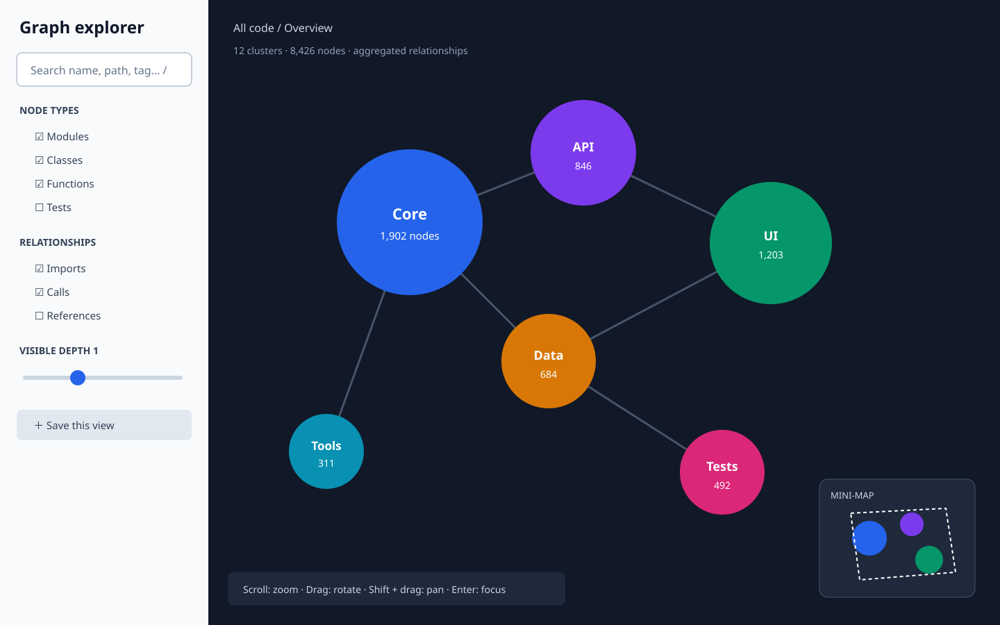
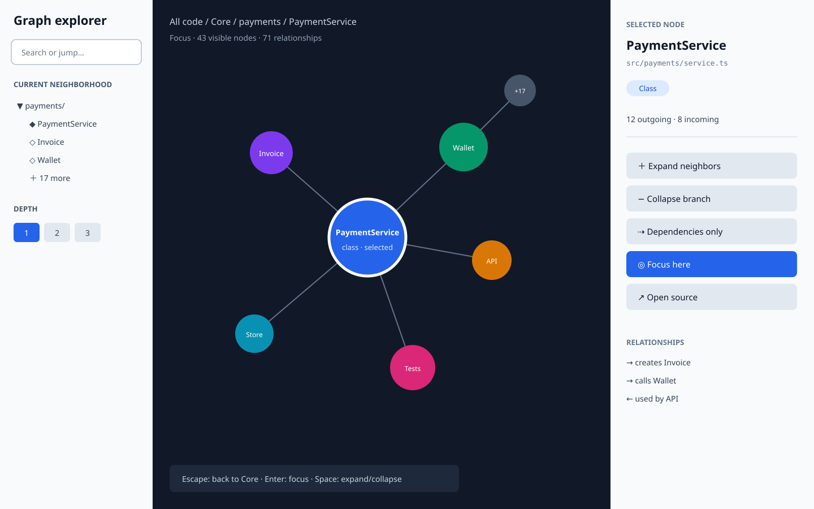
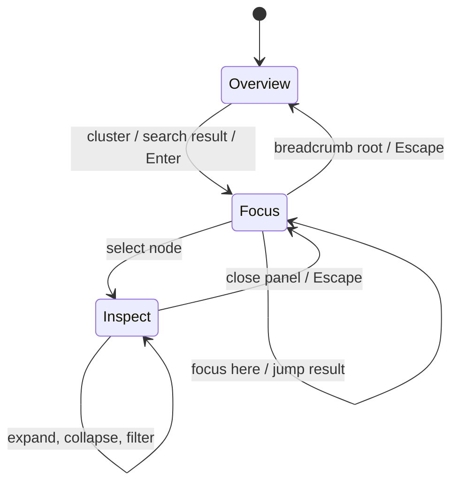

# Navigating large 3D knowledge graphs

This proposal addresses [issue #2498](https://github.com/stakwork/sphinx-nav-fiber/issues/2498).
It defines a navigation model for graphs that are too large to understand when every node
and edge is rendered at once. The examples use a code graph, but the same model applies to
people, topics, episodes, and other graph domains.

## Recommendation: start broad, render small

The initial screen should communicate the shape of the whole graph without rendering every
item. Show a stable overview made from clusters, then reveal a bounded neighborhood when the
user chooses a cluster or node. This combines the orientation benefit of “start big” with the
legibility and performance benefit of “start small.”

The interaction has three explicit levels:

1. **Overview** — clusters are the primary objects. Size represents node count, color represents
   the dominant type, and inter-cluster edges are aggregated. Search and filters work across the
   complete data set.
2. **Focus** — one cluster or search result becomes the anchor. Render the anchor, its immediate
   neighbors, and a small amount of surrounding context. Other clusters remain as subdued
   landmarks rather than disappearing.
3. **Inspect** — selecting a node opens its details and local actions without moving the camera.
   Expanding, collapsing, or following a dependency updates only the local neighborhood.

Users can always move one level up with `Escape` or the breadcrumb. The same selection and
camera target are restored when moving back down, preventing the common “lost in space” problem.



## Information architecture

### Left navigation rail

- **Search and jump** accepts a name, path, tag, or node ID. Results include their cluster path
  so identical names remain distinguishable.
- **Type filters** toggle modules, classes, functions, files, people, or domain-specific types.
- **Relationship filters** toggle imports, calls, ownership, references, and other edge types.
- **Depth** controls how many hops are visible, from 0 to 3. The default is 1.
- **Saved views** preserve filters, anchor, expansion state, and camera pose in a shareable URL.

Filters should never silently remove the current anchor. If a filter would hide it, keep the
anchor visible with a “filtered anchor” badge and offer to clear the conflicting filter.

### Main 3D canvas

- Scroll or pinch zooms; drag rotates; `Shift` + drag pans.
- Hover highlights the shortest visible relationship path and shows a compact tooltip.
- A single click selects without changing the camera. Double-click or `Enter` focuses and moves
  the camera using a short, interruptible animation.
- Empty space click clears inspection but preserves the current focus.
- A mini-map shows the focused cluster, camera frustum, and nearby clusters. It is a navigation
  control, not a second fully interactive graph.

### Inspector panel

The right panel shows identity, path, type, important metadata, and incoming/outgoing counts.
Local actions are:

- **Expand neighbors** — add the next bounded page of neighbors.
- **Collapse branch** — remove descendants introduced from this node.
- **Dependencies only** — apply a temporary relationship filter scoped to the node.
- **Focus here** — make this node the new anchor and add it to the breadcrumb.
- **Open source** — navigate to the corresponding file, issue, or external resource when present.



## Progressive disclosure rules

The client should maintain a navigation state independent from rendered Three.js objects:

```ts
type GraphNavigationState = {
  level: 'overview' | 'focus' | 'inspect'
  anchorId?: string
  selectedId?: string
  breadcrumb: Array<{ id: string; label: string; camera: CameraPose }>
  filters: { nodeTypes: string[]; edgeTypes: string[]; query: string }
  depth: 0 | 1 | 2 | 3
  expandedNodeIds: string[]
  hiddenBranchIds: string[]
}
```

Every expansion is bounded. When a node has more neighbors than the current display budget,
show a `+N more` aggregate node and fetch another page only when it is activated. Expansion must
be reversible, and collapsing must remove only nodes introduced by that branch.

Suggested initial display budgets:

| Level | Nodes | Edges | Representation |
| --- | ---: | ---: | --- |
| Overview | 8–40 clusters | 100 aggregated | Cluster landmarks |
| Focus | 80 | 250 | Anchor plus one-hop context |
| Inspect | 150 | 500 | User-expanded local graph |

When a budget is reached, preserve the anchor, selected node, breadcrumb ancestors, and shortest
paths between them. Rank remaining nodes by relationship weight and recency of interaction.

## Transitions and orientation



Camera motion should reinforce these transitions rather than decorate them:

- Overview to Focus: zoom toward the chosen landmark while its cluster expands in place.
- Focus to Inspect: keep the camera fixed and open the panel, avoiding unnecessary motion.
- Focus to Focus: draw a temporary path to the destination, then travel along it.
- Back: restore the captured camera pose instead of calculating a new one.

Animations should last 200–450 ms, respect `prefers-reduced-motion`, and be cancelled immediately
when the user scrolls, drags, presses `Escape`, or selects another destination.

## Keyboard and accessible equivalent

A 3D canvas alone is not an accessible information surface. Pair it with a synchronized tree/list
view that exposes the same current neighborhood.

- `/` focuses search.
- `Tab` moves between controls, graph/list, and inspector.
- Arrow keys move between visible neighbors in the list representation.
- `Enter` selects or focuses; `Space` expands/collapses; `Escape` moves up one level.
- Selection changes are announced through an `aria-live="polite"` region, including node type,
  relationship count, and current depth.
- Node meaning must not rely on color alone; use shape/icon plus text in tooltips and the list.

## Empty, loading, and error states

- Loading retains the previous graph and marks the pending branch with a spinner; it does not
  blank the canvas.
- A filter with no results explains which filters are active and offers “Clear filters.”
- Failed expansion leaves the aggregate node in place with a retry action.
- Deleted or unavailable breadcrumb nodes remain readable and allow navigation to the nearest
  valid ancestor.

## Delivery sequence

1. Separate navigation state from rendering state and add URL serialization.
2. Add search/jump, breadcrumbs, filters, and bounded one-hop focus.
3. Add inspector actions and reversible branch expansion.
4. Add overview clustering and mini-map landmarks.
5. Add synchronized list navigation, reduced motion, and announcements.

Each slice is independently useful and can be tested without completing the full 3D redesign.

## Success measures

Test with graphs of 100, 1,000, and 10,000 nodes. A release is successful when:

- a user can find a named node and identify its containing cluster in at most 20 seconds;
- a user can return to the previous focus and camera pose without re-searching;
- the initial view stays within the overview budgets and reaches interaction-ready state in under
  2 seconds on the project’s supported reference device;
- expanding and collapsing a branch produces the same visible graph after a round trip;
- every canvas navigation action has a keyboard-accessible list equivalent;
- usability testing shows no unresolved “I do not know where I am” event in 5 consecutive tasks.

